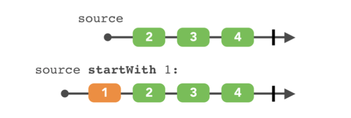
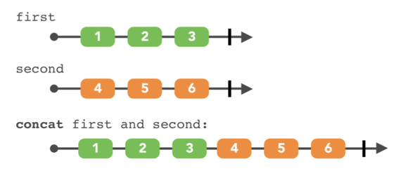

# Week 3. Practice

## Combine Operator

- StartWith
    
    
    

```swift
let first = Observable.of([1,2,3])
let second = first.startWith(4)

second
	.subscribe(onNext: {
		print($0)
}).startWith(second)

// 4
// 1
// 2
// 3
```

**sequence** 요소 맨 앞에 정의한 ‘요소’를 추가해주는 기능을 한다.
주의할 점은 무조건 맨 앞에 할당함!
초기 데이터 설정을 정의할 때 활용할 수 있을 것 같음

- Concat
    
    
    

```swift
let first = Observable.of([1,2,3])
let second = Observable.of([4,5,6])

Observable.concat([first, second])
					.subscribe(onNext: {
							print($0)
					})

// 1
// 2
// 3
// 4
// 5
// 6
```

서로 다른 ‘**sequences**’를 합쳐주는 Operator
주의할 점은 만약 stream이 끊기지 않고 유지가 되었다면 
(ex. onCompleted / onError / onDisposed 가 호출이 되지않은 상태)
다음 시퀀스인 second가 호출 되지 않는다.  Observable형태를 유의할 것! (ex. behaviorRelay)

## Thread

- 스레드는 하나의 프로세스 내에서 실행되는 작업흐름의 단위를 말합니다. 보통 한 프로세스는 하나의 스레드를 가지고 있지만, 프로세스 환경에 따라 둘 이상의 스레드를 동시에 실행할 수 있습니다. 이러한 방식을 ***멀티스레딩*** 이라고 합니다. 그리고 프로그램 실행이 시작될 때부터 동작하는 스레드를 ***메인 스레드*** 라 하고 그 외에 나중에 생성된 스레드를 ***서브 스레드*** 또는 ***세컨더리 스레드*** 라고 합니다.
출처 : [https://velog.io/@kevinkim2586/iOS-Swift-공부-동시성-프로그래밍과-비동기-프로그래밍](https://velog.io/@kevinkim2586/iOS-Swift-%EA%B3%B5%EB%B6%80-%EB%8F%99%EC%8B%9C%EC%84%B1-%ED%94%84%EB%A1%9C%EA%B7%B8%EB%9E%98%EB%B0%8D%EA%B3%BC-%EB%B9%84%EB%8F%99%EA%B8%B0-%ED%94%84%EB%A1%9C%EA%B7%B8%EB%9E%98%EB%B0%8D)
    
    
    

### Background Thread를 활용하여 Data를 받고 다시 UI에 뿌려줄 때 어떻게 해야할까?

## 1. 왜 Background Thread를 활용하는가?

서버에서 온 데이터를 가지올 때, 대부분의 경우 어떻게든 그것을 파싱해야 사용할 수 있습니다. 만약 데이터가 충분히 많다면, 매핑하는 작업 자체로도 메모리와 시간을 소비합니다. 특히 그 작업이 메인 스레드에 스케쥴되어 있다면, UI가 멈출 것이고 우리 제품의 유저 경험에 대단히 충격적인 결과를 초래할 것입니다

## 2. Scheduler는 사실 Thread가 아니였다?

스케쥴러는 실제로 진짜 스레드는 아닙니다. 하지만 이름이 뜻하는 것과 같이 그것들은 주어진 작업을 스케쥴링 하는 작업을 합니다. 그리고 스케쥴러에는 2가지 종류로, 시리얼(Serial)과 컨커런트(Concurrent)가 있습니다. 아래는 이미 만들어져있는 스케쥴러의 목록입니다:

- CurrentThreadScheduler (**시리얼**) - 현재 스레드에 있는 스케쥴러입니다. 그리고 **기본** 스케쥴러이기도 합니다.
- MainScheduler (**시리얼**) - 메인 스레드에 있는 스케쥴러입니다.
- SerialDispatchQueueScheduler (**시리얼**) - 특정 큐(`dispatch_queue_t`)에 있는 스케쥴러입니다.
- ConcurrentDispatchQueueScheduler (**컨커런트**) - 특정 큐(`dispatch_queue_t`)에 있는 스케쥴러입니다.
- OperationQueueScheduler (**컨커런트**) - 특정 큐(`NSOperationQueue`)에 있는 스케쥴러입니다.

흥미로운 점은 **컨커런트한 큐를 시리얼 스케쥴러** 에 보낸다면 RxSwift는 **시리얼 큐** 로 바꿔줍니다.

출처 : [https://pilgwon.github.io/blog/2017/10/14/RxSwift-By-Examples-4-Multithreading.html](https://pilgwon.github.io/blog/2017/10/14/RxSwift-By-Examples-4-Multithreading.html)

# Kingfisher vs SDWebImage

참고 : [https://gist.github.com/linearhw/a0677b967b741abf9b8a903c37d3bcc9](https://gist.github.com/linearhw/a0677b967b741abf9b8a903c37d3bcc9)

KingFisher는 Swift로 작성되어있음
SDWebImage는 Obj-C로 작성되어있음

### **문제점**

- NSCache 가 생각대로 동작하지 않음

### **KingFisher (리사이즈 없이)**

- back 버튼을 누르거나 스크롤을 하면 간헐적으로 버벅임
- 이미지를 다 불러오지 않고 back 버튼을 눌러서 나오기 > 다시 진입 > 나오기 를 반복하면 메모리 사용량이 계속 상승함
    - 이 경우 clearCache 해도 아무 효과 없음
    - KingfisherManager.shared.downloader.cancelAll() 하면 메모리 사용량이 줄어든다
    - SDWebImage 는 back 버튼을 눌러서 나오면 바로 메모리 사용량이 줄어듬
- 따라서 Kingfisher 를 쓸 때는 반드시 resize processor 를 넣어줘야 할 듯하다

### **Kingfisher (GIF)**

- gif url 에 대해 ResizingImageProcessor 를 쓰면 gif load 가 되지 않는다 (다른 Processor 도 마찬가지)
- 따라서 gif 인 경우와 그렇지 않은 경우를 직접 구분해 줘야 한다.

### **SDWebImage**

- 용량이 큰 사진들을 불러올 때, GIF 를 여러 개 불러올 CPU가 가끔 튄다

### 적용?

KingFisher로 넘어가야하나? resize processor를 꼭 넣어줘야하지만
속도 차이가 분명 있고 swift로 작성되어있어 라이브러리 까봤을때 파악하기 더 쉬운데
바꾸면 이점이 분명히 있음! 아래 URL 참고하기

참고 : [https://jinsky90.github.io/kingFisher(이미지-캐싱-라이브러리)-킹피셔/](https://jinsky90.github.io/kingFisher(%EC%9D%B4%EB%AF%B8%EC%A7%80-%EC%BA%90%EC%8B%B1-%EB%9D%BC%EC%9D%B4%EB%B8%8C%EB%9F%AC%EB%A6%AC)-%ED%82%B9%ED%94%BC%EC%85%94/)

아까 쓰레드 공부하면서 SDWebImage 소스를 까보고 있는데.. obj-c라서 모르겠다..
대체 어디서 이미지 다운 받을때 쓰레드를 백그라운드로 돌리지 하고 찾고 있는데..
runLoop 변수명들이 보이는 것 보면 백그라운드로 쓰레드 돌리고 그에 따라 runLoop 처리하고 있는것 같은데..

# Run Loop

Thread 는 각자의 Run Loop를 소유, Thread 생성할때 자동으로 생성

- 한 번의 실행 동안 Thread에 도착한 이벤트를 받고 이에 대한 핸들러를 수행하는 객체
- 실행을 계속 반복하고 있지 않고 Event Source를 읽고 전달하는 실행이 끝나면 그대로 대기 (절전모드)

Main Thread 에서는 자동으로 설정, 실행
Global Thread 에서는 직접 실행해야 동작

- Input Sources: 다른 Thread나 Application으로부터 온 async 이벤트 전달
- Timer Sources: 예약 된 시간 또는 일정 간격으로 반복적으로 발생하는 sync 이벤트 전달

### Run Loop 객체 참조 방법

생성된 queue안에서 객체를 획득하여 사용 (RunLoop는 자동으로 생성되므로 참조하여 바로 사용)

```swift
let runLoop = RunLoop.current
```

출처 : [https://ios-development.tistory.com/515](https://ios-development.tistory.com/515)
