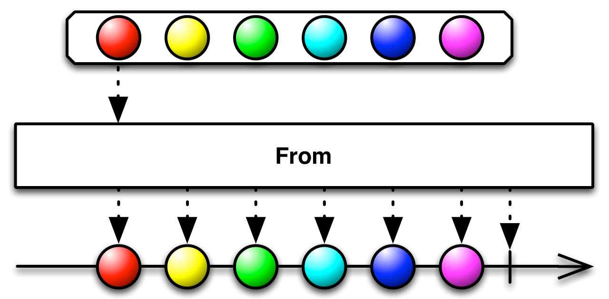

# ReactiveX 개념

### 목차

1. ReactiveX 란?
   1. 정의
   2. 반응형 프로그래밍
   3. 명령형 프로그래밍
   4. 다이어그램 보는 법
   5. ReactiveX를 구성하는 요소
2. 함수형 프로그래밍
3. 옵저버 패턴

### 참고 사이트

- [RxJava이해하기](https://4z7l.github.io/2020/12/01/rxjava-1.html)
- [코딩없는 프로그래밍-옵저버 패턴](https://www.youtube.com/watch?v=1dwx3REUo34)
- [함수형 프로그래밍-드림코딩 엘리](https://www.youtube.com/watch?v=4ezXhCuT2mw)
- [반응형 프로그래밍에 대해 알아야할 5가지 사항](https://developers.redhat.com/blog/2017/06/30/5-things-to-know-about-reactive-programming)
- [RxJS 를 사용한 JavaScript 의 반응형 프로그래밍](https://dev.to/sagar/reactive-programming-in-javascript-with-rxjs-4jom)
- [반응형 프로그래밍에서 당신이 놓친것](https://gist.github.com/staltz/868e7e9bc2a7b8c1f754)

<br/>
<br/>

# 1. ReactiveX 란?

### 정의

[ReactiveX 공식사이트](http://reactivex.io/intro.html)에서의 정의는 다음과 같다:

```
ReactiveX is a library for composing **asynchronous** and event-based programs
by using observable sequences.

It extends the observer pattern to support sequences of data and/or events
and adds operators that allow you to compose sequences together declaratively
while abstracting away concerns about things like low-level threading,
synchronization, thread-safety, concurrent data structures, and non-blocking I/O.
```

- ReactiveX 는 라이브러리다.
  **Observable sequences** 를 사용해 비동기와 이벤트 기반 프로그램을 구성한다.
- 데이터나 이벤트의 sequence 를 지원하기 위해 **Observer pattern** 을 확장한다.
- 다음과 같은 우려를 해소한다.
  low-level 스레딩, 동기화, thread-safety, concurrent data structure, non-blocking I/O

여러 스레드를 사용하는 경우, 예상하지 못한 문제가 발생할 수 있고 디버깅이 어렵다.

RX 는 함수형 프로그래밍 방식을 도입했다. **함수형 프로그래밍**은 **Side Effect** 가 없는 순수 함수를 지향하기 때문에 Thread-Safe 하다.

함수형 프로그래밍이 왜 Side Effect가 없는지는, 아래에서 확인 해 볼수 있다.

> Side Effect:
> 함수를 호출했을때 외부의 상태가 변경되거나, 예상하지 못한 에러가 발생하는 현상.
> 사이드 이펙트가 없으면, 멀티쓰레딩 환경에서 안정적으로 동작할 수 있게 한다.

<aside>
💡 Sequence:
(사전뜻) 연속적인 사건들.<br/>
Observable sequence 는 관찰 가능한 연속적인 사건들 이라는 뜻이다.
</aside>

### 반응형 프로그래밍(Reactive Programming)

> 데이터 흐름과 전달에 관한 프로그래밍 패러다임.
> 데이터의 흐름을 먼저 정의하고 데이터가 변경되었을때 연관된 작업이 실행된다.
> 즉, 어떠한 이벤트가 발생했을때, 미리 정의해놓은 작업을 알아서 처리하게 한다. 그래서 반응형 프로그래밍이라고 부르는 것이다.

RP를 도입함으로서 코드의 추상화 수준을 높일 수 있으며, 간결한 코드를 통해 비지니스 로직에 더욱 집중할 수 있게 도와준다. (추상화 수준을 높인다는 것은, 동작의 세부구현사항을 고려하지 않아도 된다는 것이다.)

웹앱, 모바일앱은 다수의 real-time event 를 적절히 대처하기 위한 도구로서 RP 가 좋은 선택일 수 있다.

<br/>

### 명령형 프로그래밍(Imperative Programming)

절차를 명시해 순서대로 실행한다. 일반적인 프로그래밍 방법.

```swift
var array = [Int]()
for i in 1..<20 {
	if (i % 2 == 0) {
		array.append(i)
	}
}
```

<br/>

### 다이어그램 보는 법

Obsrverble 은 하나 또는 연속된 항목을 배출하고, 이에 옵저버는 반응한다.

객체가 배출되면 이를 감시하는 관찰자를 옵저버 안에 두고, 그 관찰자를 통해 배출에 대한 알림을 받는다.



- 구슬: 데이터. Observable 에서 발행하는 데이터. 스트림을 따라 전달되게 된다.
  Int, String 같은 타입 뿐만 아니라 사용자 입력 이벤트 심지어 실패까지도 스트림으로 전달된다.
- → : 스트림(timeline)
- | : complete. 데이터 발행이 완료되었음을 나타낸다. 더이상 데이터를 받지 않는다.
- x: error. 오류발생. Observable 이 종료된다.
- ㅁ : 연산자

from 은 Observable 생성연산자 이므로, →(스트림) 이 나온다.

map 과 같은 연산자는 stream 이 있어야 사용할 수 있다.

<br/>

### Rx의 옵저버 패턴이 발생하는 순서

1. Observable 이 데이터 스트림을 처리하고, 완료되면 데이터를 발행(emit) 한다.
2. 데이터를 발행할때마다 구독하고 있는 모든 Observer가 알림을 받는다.
3. Observer 는 수신한 데이터를 이용해 어떠한 일을 처리한다.

<br/>

### Rx 를 구성하는 요소

- Observable:
  - 데이터 스트림의 생산자.
  - Observable 인스턴스는 누군가가 구독을 할때만 데이터를 주기적으로 emit(발행, 방출) 한다.
- Observer:
  - Observable 을 구독하여 Observable이 발행한 데이터를 소비한다.
- Operator:
  - Observable 을 통해 연산하여 Observable 을 반환하는 순수 함수이다.
  - 다양한 연산자를 제공한다(생성, 변환, 필터링, 오류처리...)
- Scheduler
  - Observable, Observer 가 어느 스레드에서 동작해야 할 지를 알려주는 컴포넌트

<br/>
<br/>

# 2. 함수형 프로그래밍

- 1958년에 LISP 함수형 프로그래밍 언어 탄생(C언어 1972 보다 이전)

사람과 사고방식에 가까운 절차지향, 객체지향이 많이 사용되었다.

함수형 프로그래밍은 수학과 밀접한 관련이 있다. ⇒ input 을 넣으면 처리과정을 거쳐 output 이 나온다.

이런 함수를 파이프처럼 묶어서 프로그래밍 하는 방법을 함수형 프로그래밍이라고 부른다.

외부에서는 파이프 안속에 어떠한 일이 일어나는지 볼 수 없다. (파이프 안에서도 밖을 볼 수 없다)

<br/>

**함수형 프로그래밍의 특징:**

1.  순수함수 (Pure Functions)
    외부의 상태를 참조하거나 변경하지 않는다.
    (외부의 상태를 변경한다면, 절차지향적 프로그래밍일 수 있다)
    동일한 인자를 넣었을때 항상 동일한 결과값을 반환한다.
2.  비상태, 불변성 유지(Stateless, Immutability)
    인자로 전달받은 데이터를 변경하는 것이 아닌, 새로운 오브젝트를 만들어서 결과값으로 전달해야 한다.
    인자의 상태를 변경하지 않음으로서, 사이드 이펙트를 만들지 않고 불변성을 유지할 수 있다.

        ```jsx
        // ❌ 안좋은 방법
        let espresso = { name: 'espresso', beans: 10 };
        function increaseBean(coffee) {
        	coffee.beans = coffee.beans + 1;
        	return coffee;
        }

        // ⭐️ 인자의 상태를 변경하지 않음 => 사이드 이펙트를 만들지 않는다.(불변성유지)
        const espresso = { name: 'espresso', beans: 10 };
        function increaseBean(coffee) {
        	return {...coffee, beans: coffee.beans + 1};
        }
        ```

3.  Expressions Only
    if, switch, for ..를 사용하는 것은 함수형 프로그래밍이 아니다.
    ```jsx
    function multiply(numbers, multiplier) {
      return numbers.map((num) => num * multiplier);
    }
    ```
4.  First-class(일급 함수)
    1. 함수를 변수에 할당
    2. 함수에 인자로 전달,
    3. 함수를 반환
5.  higher-order functions(고차함수)
    1. 함수 자체를 인자로 전달
    2. 함수에서 또다른 함수를 반환

<br/>
<br/>

# 3. Observer Pattern (감시자 패턴)

감시자들이 어느 한곳을 계속 감시하고 있다가, 이벤트가 발생했을때 감시자들이 반응할 수 있도록 하는 패턴.

Observer 는 Subscriber, Lietener 라고 부르기도 한다.

만약, 옵저버 패턴을 사용하지 않는다면 이벤트가 발생할때까지 매 시간마다 확인하는 절차가 필요할 것이다.(=polling)

옵저버 패턴의 예는 다음과 같다:

- 알람이 울리면(이벤트), 출근 준비를 한다.
- 버튼을 터치하면(이벤트), 회원 가입페이지로 이동한다.

<aside>
💡 ReactiveX 에서 옵저버 패턴:<br/>
Observable 이 데이터 흐름에 맞게 알림을 보낸다.
이를 Observer 가 지켜보고 있다가, 알림을 받으면 데이터를 처리한다.
즉 Observable 은 이벤트를 발생 시키고, Observer 는 이를 구독해 이벤트가 오면 이에 반응한다.
</aside>
